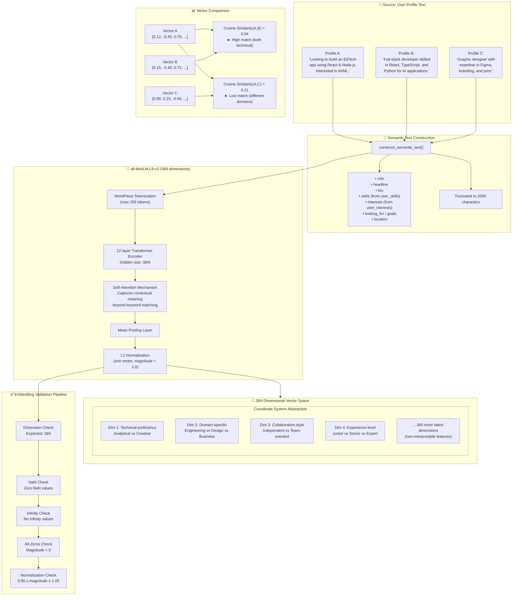
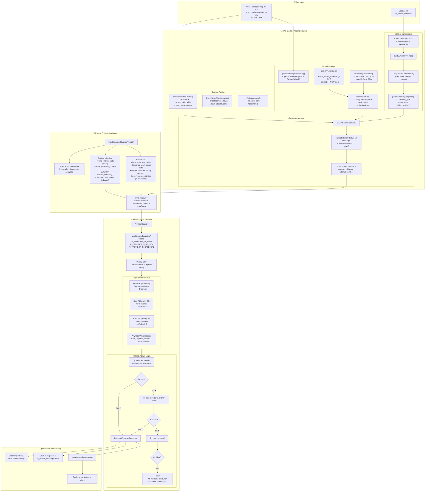

# 🤖 AI, Vector & Mathematical Mechanics Diagrams

> **Last Updated:** 2026-06-02  
> **Scope:** Embedding generation, similarity matching, multi-provider LLM orchestration, and the mathematical foundations of the matching system.

---

## Table of Contents

1. [High-Dimensional Vector Space Mapping](#1-high-dimensional-vector-space-mapping)
2. [Cosine Similarity Matching Threshold Flowchart](#2-cosine-similarity-matching-threshold-flowchart)
3. [Context-Injected Multi-LLM Orchestration Layout](#3-context-injected-multi-llm-orchestration-layout)

---

## 1. High-Dimensional Vector Space Mapping

User profiles are transformed from unstructured text into 384-dimensional mathematical vectors using the `all-MiniLM-L6-v2` Sentence Transformer model. These vectors exist in a high-dimensional space where semantic proximity correlates with cosine similarity. This diagram illustrates how textual data is mapped to coordinate systems and compared.



### How Embeddings Capture Semantics

The `construct_semantic_text()` function in both TypeScript (`@/lib/services/embeddings.ts`) and Python (`embedding_generator.py`) builds a structured string from user profile data: role, headline, bio, skills (with proficiency descriptions), interests, goals, and location. This text is fed to the `all-MiniLM-L6-v2` model, which uses 12 transformer layers with 384 hidden dimensions to produce a fixed-size vector.

The model's **self-attention mechanism** understands context: "Looking for a React developer" and "Building with React" are mapped to nearby regions in the 384-dimensional space, even though they share no exact keywords. The L2 normalization step ensures all vectors have unit length (magnitude ≈ 1.0), which is essential because cosine similarity of unit vectors is equivalent to their dot product, enabling efficient computation.

The **validation pipeline** (`embedding_validator.py`) runs six checks before storage: dimension correctness (384), absence of NaN/Inf values, non-zero magnitude, and normalization within tolerance (0.95-1.05). If an embedding fails normalization but is otherwise valid, the validator automatically re-normalizes it. Invalid embeddings trigger DLQ insertion.

### Visualizing Dimensions

The 384 dimensions are latent features learned during model training — they don't have human-interpretable labels like "technical-proficiency." However, they capture complex patterns: some dimensions activate for syntax-heavy text (code, technical terms), others for domain vocabulary (EdTech, fintech, healthtech), others for collaboration signals ("team," "lead," "mentor"). The dimensionality is a design choice that balances expressiveness (higher is better) with computational efficiency (384 is fast for HNSW search).

---

## 2. Cosine Similarity Matching Threshold Flowchart

The match generator performs programmatic filtration: pulling the logged-in user's embedding vector, querying nearby coordinates with pgvector, filtering for complementary attributes, and producing a final 0-100% compatibility score.

```mermaid
flowchart TD
    Start["🔥 User opens Match Suggestions Page"] --> Authenticate{"User Authenticated?"}
    Authenticate -->|"No"| Redirect["Redirect to /login"]
    Authenticate -->|"Yes"| FetchEmbedding["Fetch user's embedding from<br/>profile_embeddings table"]

    FetchEmbedding --> HasEmbedding{"Embedding exists?"}
    HasEmbedding -->|"No"| TriggerGen["Trigger embedding generation<br/>(/api/embeddings/generate)"]
    TriggerGen --> ShowPending["Show: 'Generating your matches...'"]

    HasEmbedding -->|"Yes"| VectorSearch["pgvector Cosine Similarity Search:<br/>SELECT 1 - (embedding <=> query_embedding)<br/>FROM profile_embeddings<br/>WHERE user_id != auth.uid()"]

    VectorSearch --> SimilarityFilter{"Similarity > 0.5<br/>(50% threshold)?"}
    SimilarityFilter -->|"≤ 0.5 — Too dissimilar"| ExcludeLow["Exclude — below semantic floor"]
    SimilarityFilter -->|"> 0.5 — Candidate"| MultiFactorScoring

    subgraph MultiFactorScoring["📊 Multi-Factor Scoring Engine"]
        Semantic["Semantic Similarity<br/>Weight: 40%<br/>Score: cosine_similarity × 0.4"]

        Skills["Shared Skills Overlap<br/>Weight: 25%<br/>Score: (matching_skills / total_skills) × 0.25"]

        Interests["Shared Interests<br/>Weight: 20%<br/>Score: (matching_interests / total_interests) × 0.20"]

        Activity["Activity Level<br/>Weight: 10%<br/>Score: user_activity_score × 0.10"]

        Reciprocity["Reciprocity Signal<br/>Weight: 5%<br/>Score: mutual_likeliness × 0.05"]

        Combined["Total Score =<br/>Semantic + Skills + Interests + Activity + Reciprocity<br/>► Normalized to 0-100%"]
    end

    MultiFactorScoring --> RuleFilters["🏷️ Rule-Based Filters"]

    subgraph RuleFilters["Complementary Tag Matching"]
        SameSkills["Filter: Not identical skillset<br/>(React Dev shouldn't see<br/>only other React Devs)"]
        CompSkills["Boost: Complementary skills<br/>(Developer + Marketer = +15%)"]
        Blocked["Filter: Exclude blocked users<br/>and existing connections"]
        Experience["Adjust: Experience level<br/>(Senior + Junior = mentor boost)"]
        Location["Adjust: Location preference<br/>(if user has location filter)"]
    end

    RuleFilters --> BuildSuggestions["Build match_suggestions rows"]

    BuildSuggestions --> PersistResults["Persist to match_suggestions + match_scores<br/>INSERT INTO match_suggestions (user_id, suggested_user_id, score, ...)<br/>INSERT INTO match_scores (suggestion_id, semantic, skills, ...)"]

    PersistResults --> ReturnResults["Return sorted matches to UI<br/>MatchCard components render<br/>score + compatibility breakdown"]

    subgraph EdgeCases["⚠️ Edge Case Handling"]
        NoMatch["No matches found →<br/>Suggest broadening search<br/>or completing profile"]
        LowDensity["Low match density →<br/>Lower threshold to 0.3<br/>temporarily"]
        Stale["Stale suggestions →<br/>Regenerate if older than 24h"]
    end

    ReturnResults --> EdgeCases

    style Start fill:#e1f5ff
    style MultiFactorScoring fill:#e8f5e9
    style RuleFilters fill:#fff3cd
    style EdgeCases fill:#f3e5f5
```



### Scoring Algorithm Details

The matching pipeline in `lib/services/matches.ts` calls `fetchMatches()` which enriches raw `match_suggestions` rows with full profile data. The core SQL query uses pgvector's `<=>` cosine distance operator:

```sql
SELECT 1 - (pe.embedding <=> query_embedding) AS similarity
FROM profile_embeddings pe
WHERE 1 - (pe.embedding <=> query_embedding) > 0.5
ORDER BY similarity DESC
```

The 0.5 threshold is the semantic floor — below this, profiles are considered too dissimilar regardless of other factors. Above this threshold, the multi-factor scoring engine takes over with weighted components: semantic similarity (40%), shared skills via `calculate_skills_overlap()` database function (25%), shared interests (20%), activity level (10%), and reciprocity signals (5%).

The **complementary tag matching** rule prevents the "echo chamber" problem: a React developer isn't shown only other React developers. The system boosts cross-functional matches (developer + designer, technical + business) by +15% on the final score. Existing connections, blocked users, and dismissed matches are filtered out. Match suggestions older than 24 hours are regenerated to ensure freshness.

---

## 3. Context-Injected Multi-LLM Orchestration Layout

The AI Mentor doesn't just call an LLM with a raw prompt. It assembles a rich context packet from the user's profile, vector store, session history, and startup data, then routes it through a polymorphic provider registry with automatic failover.



### Provider Registry Architecture

The AI provider system in `@/lib/ai/providers/registry.ts` implements a **priority-sorted, auto-discovering, circuit-breaking registry**. At startup, `autoRegisterProviders(registry)` reads environment variables matching the pattern `AI_PROVIDER_N_NAME`, `AI_PROVIDER_N_API_KEY`, `AI_PROVIDER_N_BASE_URL`, etc. Each provider is instantiated as either an `AnthropicNativeProvider` (if the base URL contains `anthropic.com`) or an `OpenAICompatibleProvider` (for all others including OpenAI, Groq, Together, Ollama, MiniMax).

Providers are registered with a **priority number** where lower = higher priority. The factory defaults give MiniMax priority 10 (fastest/cheapest), OpenAI 20, Anthropic 30. The `chatWithFallback()` method first tries the requested preferred provider, then iterates through all registered providers in priority order. If the preferred provider is rate-limited (HTTP 429), it respects the `Retry-After` header before retrying. If a provider returns a 5xx error, it moves to the next provider immediately.

The **legacy hardcoded providers** (registered from `MINIMAX_API_KEY`, `OPENAI_API_KEY`, `ANTHROPIC_API_KEY` env vars) serve as backward compatibility — they're only registered if the corresponding `AI_PROVIDER_N_*` environment variables don't already cover them, preventing duplicate registration.

### RAG Assembly Details

The `assembleRAGContext()` function in `@/lib/rag/context-assembler.ts` orchestrates five parallel data sources:

1. **Profile Context** — Fetched via `fetchUserProfileContext()` from the `profiles`, `user_skills`, and `user_interests` tables. Includes the inferred career level calculated by `inferCareerLevel()` using heuristics (headline containing "senior" → senior, "student" → student, etc.).

2. **Vector Store Context** — The user's query is itself embedded (using OpenAI's embedding API with Python worker fallback) and used to search `profile_embeddings` via the `match_profile_embeddings` RPC. Simultaneously, a BM25 keyword search runs against the same data with an LRU cache (max 10 entries, 5-minute TTL). Results are fused using reciprocal rank fusion.

3. **Session Summary** — If the conversation has ≥8 messages, `summarizeSessionIfNeeded()` calls the LLM to condense the conversation into a structured summary with action items and identified skills.

4. **Conversation History** — The last 10 messages (≈4000 tokens / 16000 characters) are included verbatim.

5. **Multi-User + Startup Context** — Optional extensions that enrich the AI's understanding for collaboration and startup-mentoring scenarios.

The final assembled context is injected into the system prompt via `buildEnhancedSystemPrompt()` (in `@/lib/prompt/ai-mentor-prompts.ts`) which constructs a persona-driven prompt referencing the user's actual profile data, skills, goals, and relevant context from the vector store.
