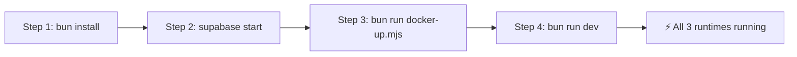

# 🛠️ DevOps, Infrastructure & Local DX Diagrams

> **Last Updated:** 2026-06-05  
> **Scope:** Local development environment, data seeding pipeline, and production deployment topology.

---

## Table of Contents

1. [Tri-Language Multi-Runtime Local Environment Sandbox](#1-tri-language-multi-runtime-local-environment-sandbox)
2. [Interactive Multi-Module Data Seeding Blueprint](#2-interactive-multi-module-data-seeding-blueprint)
3. [Production Deployment Topology](#3-production-deployment-topology)

---

## 1. Tri-Language Multi-Runtime Local Environment Sandbox

Running Collabryx locally requires orchestrating **three distinct runtimes** simultaneously: Node.js (via Next.js 16), Deno (via the Supabase CLI), and Python (via the FastAPI Docker container).

```mermaid
graph TB
    subgraph DevMachine["💻 Developer Machine"]
        subgraph NodeRuntime["🟢 Runtime 1: Node.js (Next.js 16)"]
            N_Process["bun run dev<br/>— Next.js 16 dev server"]
            N_Port["Port 3000<br/>(HTTP)"]
            N_Env[".env.local<br/>NEXT_PUBLIC_SUPABASE_URL<br/>NEXT_PUBLIC_SUPABASE_ANON_KEY<br/>PYTHON_WORKER_URL<br/>AI_PROVIDER_N_*"]
            N_DevTools["Dev Tools:<br/>• HMR (Hot Module Replacement)<br/>• React DevTools<br/>• Next.js DevTools Panel<br/>• TypeScript watch mode"]
            N_Deps["Dependencies:<br/>• bun install (lockfile)<br/>• 300+ npm packages<br/>• shadcn/ui components"]
        end

        subgraph DenoRuntime["🔵 Runtime 2: Deno (Supabase CLI)"]
            D_Process["supabase start<br/>— Local Supabase stack"]
            D_Services["Services Emulated:<br/>• PostgreSQL 15 (port 54322)<br/>• Auth service (port 54321)<br/>• Realtime engine<br/>• Storage API (S3-compatible)<br/>• Edge Functions runtime"]
            D_Migrations["supabase migration up<br/>• Applies 39 table schemas<br/>• Runs all RLS policies<br/>• Seeds test data"]
            D_Studio["supabase studio<br/>— Web UI at port 54323<br/>• Table browser<br/>• SQL editor<br/>• Auth user management"]
        end

        subgraph PythonRuntime["🐍 Runtime 3: Python (FastAPI Docker)"]
            P_Process["Docker Container<br/>collabryx-worker"]
            P_Build["Build (Dockerfile):<br/>• Stage 1: uv build deps<br/>• Stage 2: python:3.11-slim<br/>• Pre-download ML model<br/>• Copy app code"]
            P_Port["Port 8000<br/>(HTTP)"]
            P_Env[".env (python-worker)<br/>SUPABASE_URL<br/>SUPABASE_SERVICE_ROLE_KEY<br/>ALLOWED_ORIGINS<br/>LOG_LEVEL"]
            P_Health["Health Check:<br/>GET /health<br/>→ model loaded, DB connected, queue status"]
            P_Model["Model: all-MiniLM-L6-v2<br/>Pre-downloaded at build time<br/>(Prevents runtime download failures)"]
            P_Scripts["Helper Scripts:<br/>• docker-up.mjs (start + wait)<br/>• docker-down.mjs (stop + clean)<br/>• docker-logs.mjs (stream logs)<br/>• docker-health.mjs (monitor)"]
        end

        subgraph SharedInfra["🔄 Shared Infrastructure"]
            DockerEngine["Docker Engine<br/>(Required for Python worker)"]
            Git["Git + GitHub<br/>• Conventional commits<br/>• PR-based workflow"]
            Bun["Bun Runtime<br/>(Package manager + dev server)"]
            EnvFiles["Environment Files:<br/>• .env.local (Next.js)<br/>• python-worker/.env<br/>• supabase/config.toml"]
        end
    end

    N_Process -->|"http://localhost:3000"| Browser["🌐 Browser Development"]
    N_Process -->|"supabase.supabase.co"| D_Services
    N_Process -->|"http://localhost:8000"| P_Process

    D_Process --> D_Services
    D_Services -->|port 54322| PG["PostgreSQL Database"]

    P_Process -->|"Supabase SDK (Service Role)"| D_Services
    P_Process --> P_Health
    P_Process --> P_Model

    N_Process --> N_Env
    P_Process --> P_Env
    D_Process --> D_Migrations
```

### Developer Workflow

---

## 2. Interactive Multi-Module Data Seeding Blueprint

The Python-based CLI seeder (`scripts/seed-data/`) populates the database with realistic test data. It processes dependencies sequentially through 8 phases.

```mermaid
graph TB
    subgraph SeederCLI["📦 Seeder CLI: python main.py"]
        EntryPoint["main.py<br/>Argparse-based CLI"]
        Flags["Flags:<br/>• --all: Seed everything<br/>• --users: Users only<br/>• --embeddings: Vectors only<br/>• --posts: Social content only<br/>• --matches: Match data only<br/>• --connections: Connections only<br/>• --messages: Message threads<br/>• --clear: Wipe before seeding"]
    end

    subgraph DependencyGraph["🔗 Dependency Graph (Execution Order)"]
        Phase1["Phase 1: Foundation<br/>• Config loading (env, constants)<br/>• Supabase client init (service role)<br/>• Truncate existing data<br/>(if --clear flag set)"]

        Phase2["Phase 2: Users<br/>• Profiles (50+) with varied roles<br/>  (student, founder, professional)<br/>• Skills (3-7 per user)<br/>• Interests (2-5 per user)<br/>• Experiences (0-3 per user)"]

        Phase3["Phase 3: Vector Embeddings<br/>• Construct semantic text from profile<br/>• Generate via Sentence Transformers<br/>  (all-MiniLM-L6-v2, 384 dim)<br/>• UPSERT into profile_embeddings<br/>  (bypasses queue for speed)"]

        Phase4["Phase 4: Social Content<br/>• Posts (200+) with varied types<br/>• Comments (500+) in nested threads<br/>• Post reactions (1000+)<br/>• Post attachments"]

        Phase5["Phase 5: Connections<br/>• Connection requests (pending + accepted)<br/>• Established connections<br/>• Blocked users"]

        Phase6["Phase 6: Match Data<br/>• Match suggestions (pre-computed)<br/>• Match scores with breakdown<br/>• Match activity log"]

        Phase7["Phase 7: Messaging<br/>• Conversations between connected users<br/>• Message threads (10-50 per conversation)<br/>  with realistic staggered timestamps<br/>• Read receipts (subset)"]

        Phase8["Phase 8: Notifications<br/>• Notifications for each user type<br/>• Varied read/unread states<br/>• Different notification types"]
    end

    SeederCLI --> Phase1
    Phase1 --> Phase2
    Phase2 --> Phase3
    Phase3 --> Phase4
    Phase4 --> Phase5
    Phase5 --> Phase6
    Phase6 --> Phase7
    Phase7 --> Phase8
```

---

## 3. Production Deployment Topology

The production deployment spans three platforms: **Vercel** (Next.js application), **Supabase** (database, auth, storage, realtime), and the **Python worker** (Docker container).

```mermaid
graph TB
    subgraph GlobalUsers["🌍 Global User Base"]
        NA["🇺🇸 North America"]
        EU["🇪🇺 Europe"]
        APAC["🇯🇵 Asia-Pacific"]
        Other["🌏 Rest of World"]
    end

    subgraph Vercel["▲ Vercel Edge Network"]
        direction TB
        EdgeNW["Vercel Edge Network<br/>200+ PoPs worldwide"]
        subgraph Compute["Compute Layer"]
            SSR_Func["Serverless Functions<br/>(Node.js 18+, 512MB)<br/>— Renders Server Components<br/>— Executes API Routes<br/>— Runs Server Actions"]
            ISR["ISR Cache<br/>(Incremental Static Regeneration)<br/>— Revalidates on demand<br/>— Stale-while-revalidate"]
            Middleware["Edge Middleware<br/>— Bot detection<br/>— Auth session check<br/>— Redirect routing"]
        end
        CDN["Vercel CDN<br/>— Static assets (JS, CSS, images)<br/>— Next.js RSC Payloads<br/>— Public files"]
    end

    subgraph SupabaseCloud["☁️ Supabase Cloud"]
        direction TB
        PG_Primary["PostgreSQL 15 Primary<br/>(US-East region)"]
        PG_Replica["Read Replica<br/>(EU-West region)"]
        Auth_Service["Auth Service<br/>— PKCE OAuth<br/>— Session management<br/>— Provider integrations"]
        Realtime_WS["Realtime Engine<br/>— CDC via WAL replication<br/>— WebSocket connections"]
        Storage_S3["Object Storage<br/>— S3-compatible<br/>— 3 buckets: post-media (50MB),<br/>  profile-media (10MB),<br/>  project-media (10MB)"]
        Edge_Func["Edge Functions<br/>(Deno runtime)<br/>— Not used for embeddings<br/>  (delegated to Python worker)"]

        PG_Primary -->|"Read replication"| PG_Replica
    end

    subgraph PythonHost["🐳 Python Worker Host"]
        direction TB
        WorkerContainer["collabryx-worker Container"]
        WorkerRes["Resources:<br/>• 1 CPU core<br/>• 1GB RAM<br/>• Read-only root fs<br/>• tmpfs for cache/logs"]
        WorkerHealth["Health: GET /health<br/>• Model loaded<br/>• DB connected<br/>• Queue depth"]
        WorkerAPI["REST API:<br/>• POST /generate-embedding<br/>• POST /generate-embedding-from-profile<br/>• POST /api/moderate<br/>• GET /health<br/>• GET /model-info"]

        WorkerContainer --> WorkerRes
        WorkerContainer --> WorkerHealth
        WorkerContainer --> WorkerAPI
    end

    subgraph Monitoring["📊 Monitoring Stack"]
        Sentry["Sentry<br/>— Error tracking<br/>— Performance monitoring"]
        Logging_Sys["Structured JSON Logging<br/>— All services log JSON"]
        HealthChecks["Health Check Endpoints<br/>— /health (Python worker)<br/>— /api/health (Next.js)"]
    end

    subgraph ExternalIntegrations["🔗 External Integrations"]
        AI1["OpenAI API<br/>(GPT-4o-mini)"]
        AI2["Anthropic API<br/>(Claude Sonnet 4)"]
        AI3["MiniMax API<br/>(M2.7)"]
        AI4["Any OpenAI-compatible<br/>(Groq, Together, Ollama)"]
        Email["SMTP / Resend<br/>— Email verification<br/>— Password reset"]
    end

    GlobalUsers -->|DNS routing to nearest PoP| Vercel

    SSR_Func -->|"Supabase SDK queries"| PG_Primary
    SSR_Func -->|"Realtime subscribe"| Realtime_WS
    SSR_Func -->|"File upload"| Storage_S3
    SSR_Func -->|"Auth operations"| Auth_Service
    Middleware -->|"Session validation"| Auth_Service

    SSR_Func -->|"POST /generate-embedding"| WorkerContainer
    SSR_Func -->|"POST /api/moderate"| WorkerContainer

    WorkerContainer -->|"Service role DB access"| PG_Primary

    SSR_Func -->|"AI_PROVIDER_N_*"| AI1
    SSR_Func -->|"AI_PROVIDER_N_*"| AI2
    SSR_Func -->|"AI_PROVIDER_N_*"| AI3
    SSR_Func -->|"AI_PROVIDER_N_*"| AI4

    SSR_Func -->|"Email service"| Email

    Vercel --> Sentry
    PythonHost --> Sentry

    subgraph Domains["🌐 Domain Configuration"]
        AppDomain["collabryx.com<br/>(Vercel)"]
        APIDomain["api.collabryx.com<br/>(Vercel)"]
        WorkerDomain["worker.collabryx.com<br/>(Docker host)"]
    end

    Vercel --> AppDomain
    Vercel --> APIDomain
    PythonHost --> WorkerDomain
```

### Environment Topology

| Environment | Next.js | Database | Python Worker | Purpose |
|-------------|---------|----------|---------------|---------|
| **Local** | localhost:3000 | Local Supabase (port 54322) | localhost:8000 (Docker) | Active development |
| **Preview** | Branch deploy on Vercel | Supabase Preview Branch | Dev worker | PR testing |
| **Staging** | staging.collabryx.com | Supabase Staging project | Staging worker | Integration testing |
| **Production** | collabryx.com | Supabase Production (US-East) | Production worker (1CPU/1GB) | Live traffic |

---

> **See also:** [`erd.md`](./erd.md) for database schema, [`index.md`](./index.md) for the full diagram catalog.
