# 🗄️ Entity-Relationship Diagram (ERD)

> **Last Updated:** 2026-06-05  
> **Scope:** Complete relational schema — 39 tables across all functional domains.  
> **Verification:** Schema verified against live Supabase PostgreSQL instance.

---

Collabryx's database contains **39 tables** organized into 10 functional domains: core identity, user extensions, social features, messaging, matching system, embedding reliability, ML feature engineering, privacy/security, notifications, and analytics.

```mermaid
erDiagram
    %% ===== CORE IDENTITY =====
    profiles {
        uuid id PK
        text email "Synced from Auth"
        text display_name
        text full_name
        text headline "Max 140 chars"
        text bio "Max 1000 chars"
        text avatar_url
        text banner_url
        text location
        text website_url
        text collaboration_readiness "available | open | not-available"
        boolean is_verified
        text verification_type "student | faculty | alumni"
        text university
        integer profile_completion
        text[] looking_for
        boolean onboarding_completed
        timestamptz created_at
        timestamptz updated_at
    }

    %% ===== USER EXTENSIONS =====
    user_skills {
        uuid id PK
        uuid user_id FK
        text skill_name
        text proficiency "beginner | intermediate | advanced | expert"
        boolean is_primary
        timestamptz created_at
    }

    user_interests {
        uuid id PK
        uuid user_id FK
        text interest
        timestamptz created_at
    }

    user_experiences {
        uuid id PK
        uuid user_id FK
        text title
        text company
        text description
        date start_date
        date end_date "null = current"
        timestamptz created_at
    }

    user_projects {
        uuid id PK
        uuid user_id FK
        text title
        text description
        text url
        text[] technologies
        timestamptz created_at
    }

    search_blocklist {
        text word PK "Blocked search terms"
    }

    %% ===== EMBEDDINGS =====
    profile_embeddings {
        uuid id PK
        uuid user_id FK, UK
        vector embedding "384 dimensions"
        text status
        jsonb metadata
        text error_message
        timestamptz last_updated
        %% HNSW index on embedding
    }

    %% ===== QUEUE TABLES =====
    embedding_pending_queue {
        uuid id PK
        uuid user_id UK
        text status "pending | processing | completed | failed"
        text trigger_source "onboarding | manual | admin | api"
        jsonb metadata
        timestamptz created_at
        timestamptz first_attempt
        timestamptz last_attempt
        timestamptz completed_at
        text failure_reason
    }

    embedding_dead_letter_queue {
        uuid id PK
        uuid user_id FK
        text semantic_text
        text failure_reason
        int retry_count
        int max_retries "Default 3"
        text status "pending | processing | completed | exhausted"
        timestamptz last_attempt
        timestamptz next_retry
        timestamptz created_at
        timestamptz resolved_at
    }

    embedding_rate_limits {
        uuid id PK
        uuid user_id
        int request_count
        timestamptz window_start
        timestamptz created_at
    }

    %% ===== SOCIAL =====
    posts {
        uuid id PK
        uuid author_id FK
        text content
        text post_type "project-launch | teammate-request | announcement | general"
        text intent "cofounder | teammate | mvp | fyp"
        text link_url
        boolean is_pinned
        boolean is_archived
        int reaction_count
        int comment_count
        int share_count
        int bookmark_count
        int version "Optimistic concurrency"
        timestamptz created_at
        timestamptz updated_at
    }

    post_attachments {
        uuid id PK
        uuid post_id FK
        text file_url
        text file_type
        text storage_path
        int file_size
        timestamptz created_at
    }

    post_reactions {
        uuid id PK
        uuid user_id FK
        uuid post_id FK
        text reaction_type "like | love | celebrate | support"
        timestamptz created_at
        %% UK(user_id, post_id)
    }

    comments {
        uuid id PK
        uuid post_id FK
        uuid user_id FK
        uuid parent_id FK "Self-ref for replies"
        text content
        int like_count
        timestamptz created_at
        timestamptz updated_at
    }

    comment_likes {
        uuid id PK
        uuid user_id FK
        uuid comment_id FK
        timestamptz created_at
        %% UK(user_id, comment_id)
    }

    %% ===== CONNECTIONS =====
    connections {
        uuid id PK
        uuid requester_id FK
        uuid receiver_id FK
        text status "pending | accepted | declined | blocked"
        text message
        timestamptz created_at
        timestamptz updated_at
    }

    blocked_users {
        uuid id PK
        uuid blocker_id FK
        uuid blocked_id FK
        text reason
        timestamptz created_at
    }

    %% ===== MATCHING =====
    match_suggestions {
        uuid id PK
        uuid user_id FK
        uuid suggested_user_id FK
        float similarity_score
        text status "pending | viewed | dismissed | connected"
        timestamptz created_at
    }

    match_scores {
        uuid id PK
        uuid suggestion_id FK
        float semantic_score
        float skills_score
        float interests_score
        float activity_score
        float reciprocity_score
        float total_score
        timestamptz created_at
    }

    match_activity {
        uuid id PK
        uuid match_id FK
        uuid user_id FK
        text activity_type "viewed_profile | sent_request | accepted"
        timestamptz created_at
    }

    match_preferences {
        uuid id PK
        uuid user_id FK, UK
        text preferred_role
        text[] preferred_skills
        int min_experience_level
        int max_distance_km
        bool show_only_complementary
        jsonb filters
        timestamptz updated_at
    }

    %% ===== MESSAGING =====
    conversations {
        uuid id PK
        uuid participant_1 FK
        uuid participant_2 FK
        text last_message_preview
        timestamptz last_message_at
        timestamptz created_at
    }

    messages {
        uuid id PK
        uuid conversation_id FK
        uuid sender_id FK
        text text
        boolean is_read
        text attachment_url
        text attachment_type "image | file"
        timestamptz read_at "null = unread"
        timestamptz created_at
    }

    %% ===== AI MENTOR =====
    ai_mentor_sessions {
        uuid id PK
        uuid user_id FK
        text title
        jsonb metadata "Startup context, session summary"
        timestamptz created_at
        timestamptz updated_at
    }

    ai_mentor_messages {
        uuid id PK
        uuid session_id FK
        uuid user_id FK "null = AI"
        text content
        text role "user | assistant"
        jsonb metadata "Tokens used, model, provider"
        timestamptz created_at
    }

    %% ===== NOTIFICATIONS =====
    notifications {
        uuid id PK
        uuid user_id FK
        text type "new_message | match_found | connection_request | ..."
        jsonb data
        bool read
        timestamptz created_at
    }

    notification_preferences {
        uuid id PK
        uuid user_id FK, UK
        bool new_message "Default true"
        bool match_found "Default true"
        bool connection_request "Default true"
        bool daily_digest
        timestamptz updated_at
    }

    %% ===== ANALYTICS & ML =====
    feed_scores {
        uuid id PK
        uuid user_id FK
        uuid post_id FK
        float score
        float thompson_sample
        jsonb score_components
        timestamptz expires_at "24h TTL"
        timestamptz created_at
    }

    feed_thompson_params {
        uuid id PK
        uuid post_id FK, UK
        float alpha "Success count (engagement)"
        float beta "Failure count (skip/hide)"
        timestamptz updated_at
    }

    post_impressions {
        uuid id PK
        uuid user_id FK
        uuid post_id FK
        text action "view | click | like | hide | share"
        timestamptz created_at
    }

    events {
        uuid id PK
        uuid user_id FK
        text event_type
        jsonb properties
        timestamptz created_at
    }

    user_analytics {
        uuid user_id PK "One row per user"
        int profile_views_count
        int profile_views_last_7_days
        int profile_views_last_30_days
        int post_impressions_count
        int post_reactions_received
        int post_comments_received
        int posts_created_count
        int match_suggestions_count
        int matches_accepted_count
        float match_acceptance_rate
        int high_confidence_matches_count
        int connections_count
        int connection_requests_sent
        int connection_requests_received
        int mutual_connections_avg
        int messages_sent_count
        int messages_received_count
        int conversations_count
        float avg_response_time_minutes
        int ai_sessions_count
        int ai_messages_count
        int sessions_count
        int total_time_spent_minutes
        timestamptz last_active
        inet last_active_ip
        float engagement_score
        float influence_score
        int activity_streak_days
        timestamptz created_at
        timestamptz updated_at
        timestamptz last_calculated_at
    }

    platform_analytics {
        date date PK
        int dau
        int mau
        int wau
        int new_users
        int deleted_users
        float active_users_change
        int new_posts
        int total_posts
        int posts_with_media
        int avg_post_length
        int new_matches
        int total_matches
        float avg_match_score
        int high_confidence_matches
        int new_connections
        int total_connections
        float connection_acceptance_rate
        int pending_requests
        int new_messages
        int total_messages
        int new_conversations
        float avg_messages_per_conversation
        int total_profile_views
        int total_post_reactions
        int total_comments
        float avg_session_duration_minutes
        int ai_sessions_count
        int ai_messages_count
        float avg_session_length
        int content_flagged
        int content_approved
        int content_rejected
        float avg_moderation_time_seconds
        int api_requests_count
        float avg_api_latency_ms
        int error_count
        float error_rate
        int embeddings_generated
        int embeddings_pending
        int embeddings_failed
        float avg_embedding_time_ms
        timestamptz created_at
        timestamptz updated_at
    }

    content_moderation_logs {
        uuid id PK
        text content_type "post | comment | message | profile"
        uuid content_id
        uuid user_id
        text action "approve | flag | reject"
        float risk_score
        float toxicity_score
        float spam_score
        float nsfw_score
        boolean pii_detected
        jsonb details "Both chain results"
        timestamptz moderated_at
    }

    %% ===== PRIVACY & AUDIT =====
    privacy_settings {
        uuid id PK
        uuid user_id FK, UK
        bool show_profile "True"
        bool show_skills "True"
        bool show_activity "True"
        bool allow_messages "True"
        timestamptz updated_at
    }

    audit_logs {
        uuid id PK
        uuid user_id FK
        text action
        text entity_type
        uuid entity_id
        jsonb old_values
        jsonb new_values
        text ip_address
        timestamptz created_at
    }

    theme_preferences {
        uuid id PK
        uuid user_id FK, UK
        text theme "light | dark | system"
        timestamptz updated_at
    }

    profile_visits {
        uuid id PK
        uuid viewer_id FK
        uuid viewed_id FK
        timestamptz viewed_at
        timestamptz expires_at
        timestamptz created_at
        timestamptz updated_at
    }

    user_bookmarks {
        uuid id PK
        uuid post_id FK
        uuid user_id FK
        timestamptz created_at
    }

    %% ===== RELATIONSHIPS =====
    profiles ||--o{ user_skills : "has"
    profiles ||--o{ user_interests : "has"
    profiles ||--o{ user_experiences : "has"
    profiles ||--o{ user_projects : "has"
    profiles ||--|| profile_embeddings : "has"
    profiles ||--o{ posts : "creates"
    profiles ||--o{ comments : "writes"
    profiles ||--o{ post_reactions : "reacts"
    profiles ||--o{ connections : "initiates"
    profiles ||--o{ conversations : "participates"
    profiles ||--o{ messages : "sends"
    profiles ||--o{ notifications : "receives"
    profiles ||--o{ ai_mentor_sessions : "has"
    profiles ||--o{ feed_scores : "scored"
    profiles ||--o{ events : "generates"
    profiles ||--o{ privacy_settings : "configures"
    profiles ||--o{ theme_preferences : "configures"
    profiles ||--o{ audit_logs : "logs"
    profiles ||--o{ match_preferences : "configures"
    profiles ||--o{ embedding_rate_limits : "rate limited"
    profiles ||--o{ blocked_users : "blocks"
    profiles ||--o{ profile_visits : "viewer"
    profiles ||--o{ profile_visits : "viewed"
    profiles ||--o{ user_bookmarks : "bookmarks"

    posts ||--o{ post_attachments : "has"
    posts ||--o{ post_reactions : "receives"
    posts ||--o{ comments : "contains"
    posts ||--o{ feed_scores : "scored in"
    posts ||--o{ feed_thompson_params : "tracks"
    posts ||--o{ post_impressions : "has"
    posts ||--o{ user_bookmarks : "referenced in"

    comments ||--o{ comment_likes : "receives"
    comments ||--o{ comments : "replies" "self-ref parent_id"

    match_suggestions ||--o{ match_scores : "scored by"
    match_suggestions ||--o{ match_activity : "tracks"
    match_suggestions }|--|| profiles : "suggests to"
    match_suggestions }|--|| profiles : "suggests"

    conversations ||--o{ messages : "contains"
    ai_mentor_sessions ||--o{ ai_mentor_messages : "contains"

    profiles ||--o{ embedding_pending_queue : "queued for"
    profiles ||--o{ embedding_dead_letter_queue : "failed for"

    connections }|--|| profiles : "requester"
    connections }|--|| profiles : "receiver"
    blocked_users }|--|| profiles : "blocker"
    blocked_users }|--|| profiles : "blocked"
```

---

## Schema Design Patterns

**39 tables** organized into 10 functional groups. Every table uses UUID primary keys. The `profiles` table is the central hub, connected to all user-owned data. The vector embedding is stored as `vector(384)` in `profile_embeddings` with an HNSW index (`vector_cosine_ops, M=32, ef_construction=128`) for efficient similarity search. Queue tables (`embedding_pending_queue`, `embedding_dead_letter_queue`) use a `user_id` unique constraint to prevent duplicate entries per user and employ atomic claim patterns (`UPDATE ... WHERE status = 'pending'`) for multi-worker safety. The `feed_thompson_params` table stores alpha/beta parameters for the Thompson Sampling bandit algorithm, updated on each user engagement action.

### Tables Not Present in Legacy Docs

| Table | Purpose | Added |
|-------|---------|-------|
| `search_blocklist` | Blocks prohibited search terms (single `word text` column) | Post-launch |
| `user_analytics` | Per-user analytics (32 columns: engagement, influence, activity scores) | Post-launch |
| `platform_analytics` | Platform-wide daily snapshots (44 columns: DAU/MAU/WAU, content moderation stats) | Post-launch |
| `content_moderation_logs` | Full moderation audit trail (12 columns: risk, toxicity, spam, NSFW, PII scores) | Post-launch |
| `events` | Generic event bus for trigger-based processing | Post-launch |

---

> **Source:** Verified against live Supabase PostgreSQL instance.  
> **See also:** [`security-architecture.md`](./security-architecture.md) for RLS policies, [`data-flow-pipelines.md`](./data-flow-pipelines.md) for queue mechanics.
