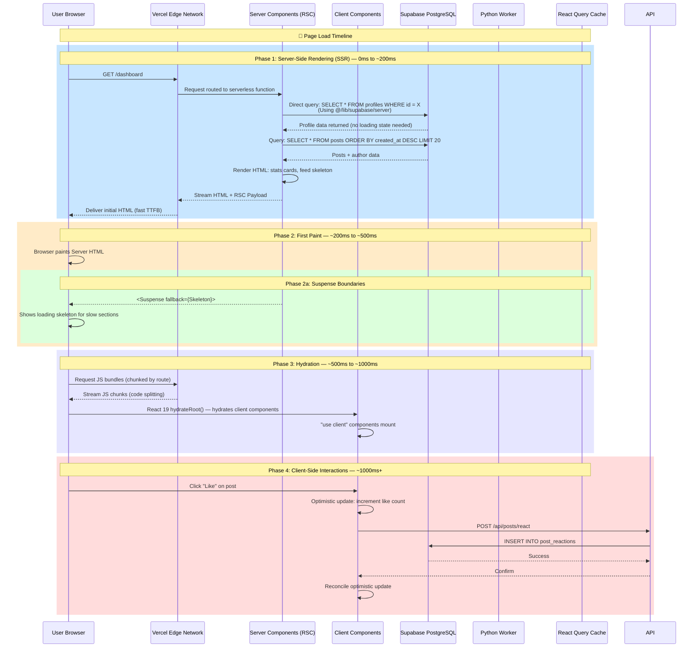
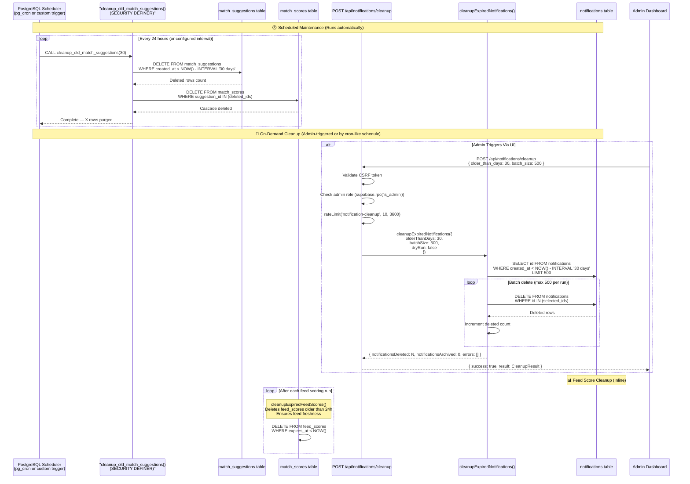

# 📡 Behavioral & Event-Driven Communication Diagrams

> **Last Updated:** 2026-06-05  
> **Scope:** Real-time synchronization, rendering timelines, and cron-driven maintenance.

---

## Table of Contents

1. [Real-Time Realtime Sync Sequence](#1-real-time-realtime-sync-sequence)
2. [Next.js Hybrid Rendering & Hydration Timeline](#2-nextjs-hybrid-rendering--hydration-timeline)
3. [Temporal Cleanup Cron Trigger](#3-temporal-cleanup-cron-trigger)

---

## 1. Real-Time Realtime Sync Sequence

Collabryx uses **Supabase Realtime** — a Change Data Capture (CDC) system built on PostgreSQL replication slots — to synchronize state across clients without a custom WebSocket server.

```mermaid
sequenceDiagram
    participant UA as User A (Sender)
    participant ClientA as Client A (Next.js)
    participant ClientB as Client B (Receiver)
    participant API as Next.js API Route
    participant DB as PostgreSQL (messages table)
    participant RL as Realtime Engine (CDC)
    participant Notif as notifications table

    Note over ClientA,ClientB: Step 1: Channel Subscription Setup
    ClientA->>DB: Subscribe to channel: messages:conversation_id=X
    ClientB->>DB: Subscribe to channel: messages:conversation_id=X
    DB->>RL: Register subscriptions (PostgreSQL replication slot)
    RL-->>ClientA: Subscription confirmed ✓
    RL-->>ClientB: Subscription confirmed ✓

    Note over UA,ClientB: Step 2: Message Send Flow
    UA->>ClientA: Types and sends message
    ClientA->>ClientA: Optimistic update: insert message into local cache<br/>(React Query setQueryData)
    ClientA-->>UA: Message appears immediately in UI (no loading)

    ClientA->>API: POST /api/chat/send<br/>{ conversation_id, content, receiver_id }
    API->>API: Validate with Zod
    API->>API: Check auth + conversation membership
    API->>DB: INSERT INTO messages<br/>(sender_id, conversation_id, content)

    DB->>RL: Detect INSERT via WAL (Write-Ahead Log)
    RL->>ClientA: Broadcast: INSERT event<br/>{ conversation_id, message_id, sender_id }
    RL->>ClientB: Broadcast: INSERT event<br/>{ conversation_id, message_id, sender_id }

    ClientA->>ClientA: Reconcile: replace optimistic message with server-confirmed
    ClientB->>ClientB: Append new message to local cache

    ClientB--->UB: "New message from User A" notification

    Note over ClientB,Notif: Step 3: Notification Side-Effect
    API->>Notif: INSERT INTO notifications<br/>{ user_id: receiver_id, type: 'new_message',<br/>  data: { sender_name, preview_text } }
    DB->>RL: Detect INSERT on notifications
    RL->>ClientB: Broadcast notification event
    ClientB->>ClientB: Show notification bell badge + toast

    Note over UA,ClientB: Step 4: Read Receipt (Typing Indicator)
    ClientB->>DB: Subscribe to channel: typing:conversation_id=X
    ClientA->>DB: Broadcast: { type: "typing", user_id: A, conversation_id: X }
    DB->>RL: Propagate typing broadcast
    RL->>ClientB: Receive typing event
    ClientB--->UB: Show "User A is typing..."

    Note over UA,ClientB: Step 5: Read Receipt
    ClientB->>DB: UPDATE messages SET read_at = now()<br/>WHERE conversation_id = X AND sender_id = A
    DB->>RL: Detect UPDATE via WAL
    RL->>ClientA: Broadcast: read_receipt event
    ClientA->>ClientA: Mark messages as read (double-check icons)
```

---

## 2. Next.js Hybrid Rendering & Hydration Timeline

Collabryx uses Next.js 16's App Router to combine server-side rendering (Server Components) with client-side hydration (Client Components).



---

## 3. Temporal Cleanup Cron Trigger

Database maintenance operations run on PostgreSQL's built-in scheduling capabilities.



---

> **See also:** [`sequence-diagrams.md`](./sequence-diagrams.md) for the sequence diagram index, [`data-flow-pipelines.md`](./data-flow-pipelines.md) for related pipeline flows.
