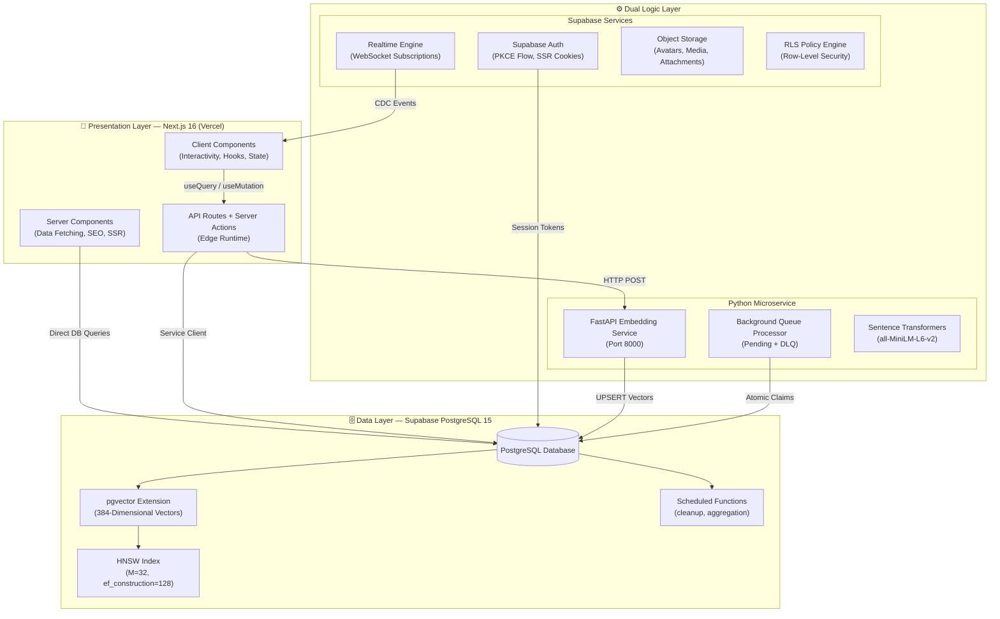
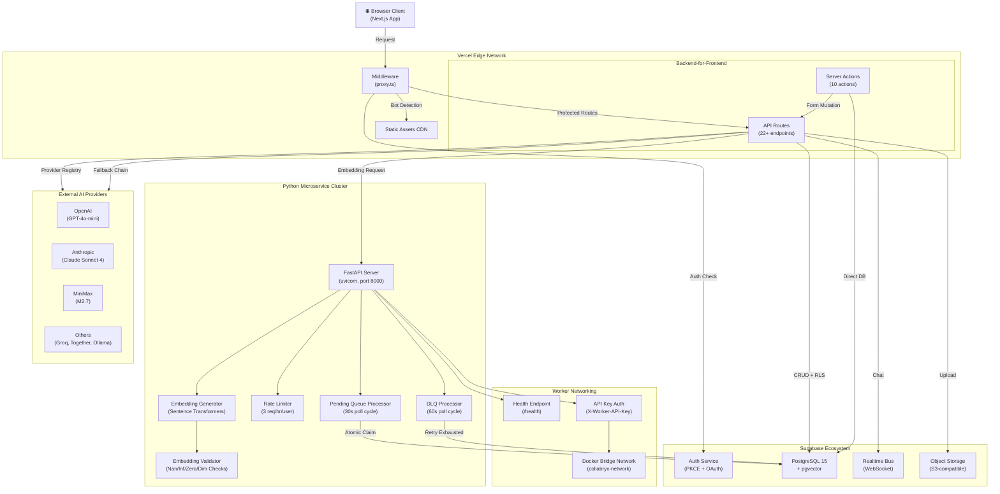

# 🏗️ High-Level & System Architecture Diagrams

> **Last Updated:** 2026-06-05  
> **Scope:** Macro-level architecture showing how Collabryx's multi-runtime stack interacts across presentation, logic, and data layers.

---

## Table of Contents

1. [Conceptual 3-Tier Architecture](#1-conceptual-3-tier-architecture)
2. [Hybrid Service-Based Microservices Topology](#2-hybrid-service-based-microservices-topology)
3. [Production Container Layout (Docker Compose)](#3-production-container-layout-docker-compose)
4. ["Before & After" Evolution Blueprint](#4-before--after-evolution-blueprint)

---

## 1. Conceptual 3-Tier Architecture

Collabryx follows a strict **3-tier architecture** that cleanly separates concerns across three independent layers. The Presentation Layer (Next.js 16) handles all user-facing rendering. The Dual Logic Layer splits business logic between Supabase (for auth, database operations, and edge functions) and the Python FastAPI worker (for compute-heavy embedding generation). The Data Layer is exclusively PostgreSQL 15 via Supabase with the pgvector extension.

### Layer Breakdown

**Presentation Layer** runs entirely on Vercel's Edge Network. Server Components fetch data directly from Supabase using the server client (`@/lib/supabase/server`) for zero client-side data exposure. Client Components handle interactivity via React 19 hooks and are placed at the lowest possible leaf nodes. API Routes and Server Actions form the backend-for-frontend (BFF) layer, handling validation with Zod, CSRF protection, and proxying requests to the Python worker.

**Dual Logic Layer** is the architectural centerpiece. Supabase handles auth (PKCE flow with SSR cookies), realtime WebSocket subscriptions for live messaging, object storage for media uploads, and enforces Row-Level Security on every query. The Python FastAPI microservice handles compute-heavy tasks: embedding generation using `all-MiniLM-L6-v2` (384 dimensions), background queue processing with atomic claim patterns, and DLQ management with exponential backoff retry (max 3 attempts).

**Data Layer** is a single Supabase PostgreSQL 15 instance with pgvector. The `profile_embeddings` table stores 384-dimensional vectors and uses an HNSW index (M=32, ef_construction=128) for fast approximate nearest-neighbor search. Scheduled functions handle data retention (cleanup old match suggestions, notification pruning).

---

## 2. Hybrid Service-Based Microservices Topology

Collabryx is **not a monolith**. It employs a hybrid topology where the Next.js application acts as an orchestrating BFF, routing requests to isolated Deno-managed edge functions and a containerized Python microservice based on workload characteristics.

---

## 3. Production Container Layout (Docker Compose)

The Python worker runs as a production-grade Docker container with defense-in-depth hardening.

> See full diagram in the original source. Mermaid diagram available in the previous version of this file.

---

## 4. "Before & After" Evolution Blueprint

Collabryx underwent a mid-project architectural transformation from a traditional MERN + Socket.io stack to a modern, AI-native stack.

> See full Before/After comparison in the previous version of this file.

---

> **See also:** [`index.md`](./index.md) for the full diagram catalog, [`erd.md`](./erd.md) for database schema, [`security-architecture.md`](./security-architecture.md) for security state.
